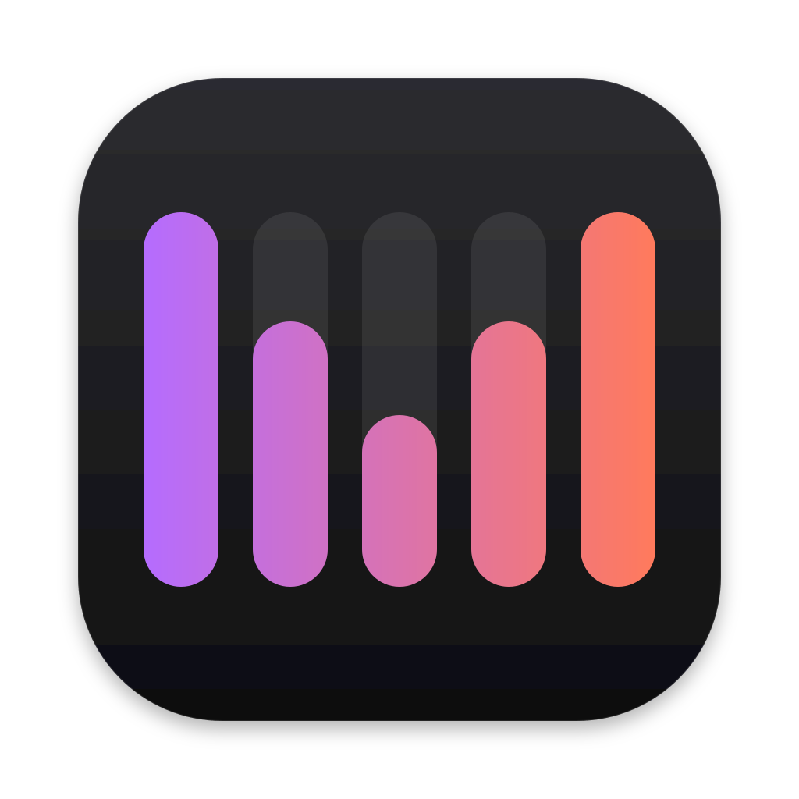

   
  🏠 <a href="https://lollipopkit.com">lollipopkit.com</a>
   
  🧐 <a href="https://blog.lpkt.cn">Blog</a> / <a href="https://cdn.lpkt.cn">CDN & Tools</a>
   
  ✉️ <a href="https://matrix.to/#/!fkiFgqgzKzTOqjLepT:matrix.org?via=matrix.org">Matrix</a> / <a href="https://t.me/lpktg">Telegram</a> / <a href="https://discord.gg/SsVNbRhK7w">Discord</a>
   
  🎁 Donate <a href="https://cdn.lpkt.cn/donate/">Ko-fi / 支付宝</a>

<!-- projects:start -->
<!-- Generated from src/lib/projects.js by `npm run readme`; do not edit by hand. -->

### Apps

| | App | About |
|---|---|---|
|  | **[ServerBox](https://github.com/lollipopkit/flutter_server_box)** | Server status and toolbox. · [Website](https://serverbox.lollipopkit.com) |
|  | **[MMetrics](https://github.com/lollipopkit/MMetrics)** | Apple Silicon system monitor for the menu bar. · [Website](https://mmetrics.lollipopkit.com) |
|  | **[MFuse](https://github.com/lollipopkit/mfuse)** | Remote storage in Finder. · [Website](https://mfuse.lollipopkit.com) |
|  | **[GPTBox](https://github.com/lollipopkit/flutter_gpt_box)** | Third-party client for the OpenAI API. |

### Tools

- [ServerBox Monitor](https://github.com/lollipopkit/flutter_server_box/tree/main/monitor) — Server-side agent for ServerBox. Needed for push notifications, widgets and the watch app; also serves a web panel.
- [lk](https://github.com/lollipopkit/lk) — A lightweight programming language written in Rust, with a VM and a native compiler backend. · [Website](https://lang.lollipopkit.com)
- [ORMC](https://github.com/lollipopkit/or-models-compare) — OpenRouter models, updated daily, with price and context comparison. · [Website](https://ormc.lollipopkit.com)
- [Liquid Glass](https://github.com/lollipopkit/liquid-glass) — Liquid glass and refraction effects for React, Svelte and Vue. · [Website](https://liquid-glass.lollipopkit.com)
- [exedev-cli](https://github.com/lollipopkit/exedev-cli) — Unofficial CLI for exe.dev.
- [sysinfo-api-mcp](https://github.com/lollipopkit/sysinfo-api-mcp) — System information over a REST API and an MCP server.
- [icons_finder](https://github.com/lollipopkit/icons_finder) — Gallery for the icons_plus Flutter package. · [Website](https://icon.lolli.tech)
- [agent-skills](https://github.com/lollipopkit/agent-skills) — Agent skills for TrailBase, handoffs, linked docs and more.
- [pi-models-metadata](https://github.com/lollipopkit/pi-models-metadata) — Pi extension that lists a provider’s models and adds OpenRouter metadata.
- [pi-tab-follow-up](https://github.com/lollipopkit/pi-tab-follow-up) — Pi extension for sending follow-up messages with Tab.
- [pi-ui-finetune](https://github.com/lollipopkit/pi-ui-finetune) — Pi extension that shortens the collapsed display of verbose tool results.
- [code_prompt.rs](https://github.com/lollipopkit/code_prompt.rs) — CLI that gathers source files into one file for AI prompts, docs or sharing.
- [fl_build](https://github.com/lollipopkit/fl_build) — Build script for Flutter projects, configured in pubspec.yaml.
- [utils.fish](https://github.com/lollipopkit/utils.fish) — fish shell utilities for archives and system management.
- [fvck_adb_mDNS](https://github.com/lollipopkit/fvck_adb_mDNS) — Connects to Android devices over Wi-Fi adb when mDNS discovery works but automatic connection does not.
- [Gogs-auto-night-theme](https://github.com/lollipopkit/Gogs-auto-night-theme) — Automatic dark mode for Gogs.
- [gitea-custom](https://github.com/lollipopkit/gitea-custom) — Custom styles for Gitea.
- [color-inverter](https://github.com/lollipopkit/color-inverter) — Inverts colors given as hex, rgb or rgba.
- [miwifi_auto_get_real_public_ip](https://github.com/lollipopkit/miwifi_auto_get_real_public_ip) — Gets the public IP of a Mi WiFi router for exposing intranet services.

### Libraries

- [fl_lib](https://github.com/lollipopkit/fl_lib) `Dart` — Shared library for the Flutter apps above.
- [redfish](https://github.com/lollipopkit/redfish) `Dart` — Client for the DMTF Redfish API that server BMCs expose.
- [image_hash](https://pub.dev/packages/image_hash) `Dart` — Image hashes for finding duplicate and similar images.
- [term](https://pub.dev/packages/term) `Dart` — Terminal control: cursor, colors and text.
- [fl_magnetic](https://pub.dev/packages/fl_magnetic) `Dart` — Magnetic-style floating bubble picker for Flutter.
- [webdav_client_plus](https://pub.dev/packages/webdav_client_plus) `Dart` — WebDAV client, a maintained fork of webdav_client.
- [ntex-basicauth](https://crates.io/crates/ntex-basicauth) `Rust` — Basic authorization middleware for ntex.
- [ntex-ratelimiter](https://crates.io/crates/ntex-ratelimiter) `Rust` — Rate limiting middleware for ntex.
- [qcl](https://crates.io/crates/qcl) `Rust` — Query Check Language, a small expression language for access control checks.
- [exa](https://github.com/lollipopkit/exa) `Go` — SDK for the Exa search API.

Filter by language and license on [lollipopkit.com](https://lollipopkit.com).
<!-- projects:end -->
